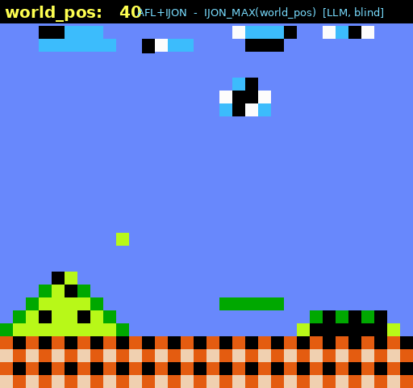

# IJON Reloaded — an LLM as the IJON fuzzing analyst

> Using an LLM to *usher fuzzers through the maze.*

**[IJON](https://github.com/RUB-SysSec/ijon)** (Aschermann et al., IEEE S&P 2020)
lets a **human analyst** break fuzzing roadblocks by adding a tiny source
annotation that reshapes AFL's feedback function — exposing program **state** that
edge coverage is blind to. With one line, AFL solves mazes, plays Super Mario,
cracks checksums, and beats CGC challenges that defeat every automated tool. The
catch: it needs the human.

**This project replaces the human analyst with an LLM agent.** An autonomous loop
runs an AFL++ campaign, detects when it plateaus, asks DeepSeek *why* it is stuck
and *what* annotation to add, applies it, rebuilds, re-runs, and keeps or reverts
on the measured result — accumulating annotations until the goal is reached. The
LLM is used **only at the two judgment points** (diagnose why-stuck, synthesize
the annotation); everything mechanical — running the fuzzer, plateau detection,
patching, rebuilding, evaluation — is deterministic Python.

<p align="center">
  <br>
  <sub><b>The fuzzer is playing.</b> A fuzzer-found Super Mario playthrough driven by an annotation
  the agent proposed <i>blind</i> — rendered ROM-free, the live <code>world_pos</code> is the reward it maximizes.</sub>
</p>

📖 **Full write-up:** [`docs/writeup/`](docs/writeup/) — a single-file
[standalone HTML page](docs/writeup/ijon-llm-writeup.standalone.html) (host on
GitHub Pages for the live version).

## Results

The agent always sees only the **answer-stripped** source (a fairness gate removes
the ground-truth annotation and every `ijon` mention) plus plateau telemetry, and
re-derives a working annotation by reasoning.

| Target | Roadblock class (agent's diagnosis) | What happened |
|---|---|---|
| **maze** | known relevant state values · `IJON_SET` | blind, **exact match** to the paper's own annotation; plain AFL stuck @16 edges, agent solves in 8 s |
| **checksum / two-gate** | missing intermediate state · `IJON_CMP` | plain: 16.3M execs, 0 solves → agent solves; two-gate solved by the loop **accumulating two annotations** |
| **maxclimb** | known relevant state values · `IJON_MAX` | plain: 0 crashes / 16.8M execs → solved |
| **libpng** (real lib) | known state changes · `IJON_STATE` | **41×** more distinct chunk-type *sequences* explored than plain AFL (over wall-clock) |
| **libpng — autonomy** | known state changes · `IJON_STATE` | the loop, rewarded on state-diversity, **autonomously reaches** `IJON_STATE(hash(mode,chunk_name))` — **30.9×** |
| **Super Mario** | known relevant state values · `IJON_MAX` | reproduces `IJON_MAX(world_pos)` blind & plays the level (effectiveness A/B is an honest tie — see below) |
| **libtpms (vTPM)** | known state changes · `IJON_STATE` | 12 h real-target deployment, two autonomous annotations → **11.5×** more command sequences than plain |

Reproducible records for the newer experiments live in
[`experiments/`](experiments/); design rationale and dead-ends in
[`docs/architecture-design.md`](docs/architecture-design.md).

### The unifying finding

**IJON helps ⟺ the relevant state is *invisible* to edge coverage.** Where state
is genuinely hidden — chunk *sequences*, a maximization score, command *orderings*
— the agent's annotation wins, and the win *compounds* with time (on libtpms the
gap grew from 6× to 11.5× as plain AFL flat-lined). Where state *leaks into*
coverage — Super Mario's `world_pos` (each new screen runs new code) — plain AFL
already has the gradient and the annotation is redundant (hence the honest Mario
tie). So the analyst's real skill isn't picking the primitive; it's choosing a
state edge-coverage doesn't already capture — which the loop learns to do.

## How it works

A deterministic loop with the model at two judgment points; the agent is a **single
reasoning call** on pre-localized source — it does not explore the codebase or
generate inputs. Its only lever is the **feedback function**.

```
fuzz → plateau → [localize] → [LLM: diagnose + annotate] → patch+rebuild → keep/revert
```

- **Fairness gate** — each benchmark ships the ground-truth annotation behind
  `#ifdef`; before the agent sees the source we strip it, redact every `ijon`
  line, and hard-assert nothing leaks. The model knows the IJON *API/taxonomy*
  (from its prompt), never the specific answer.
- **Source-coverage keep/revert** — decisions use *real* source coverage (replay
  through an llvm-cov build), never raw `edges_found` (IJON map entries inflate it
  and would fake "progress").
- **Localizer** — fuzz-introspector static call-graph × llvm-cov coverage →
  the frontier the fuzzer is stuck at, to point the model at the right code.

## Layout

```
harness/        deterministic harness + the LLM analyst (stdlib + LiteLLM)
  config.py · fuzzer.py · plateau.py · build.py · model.py · agent.py · loop.py · coverage.py · localize.py
scripts/        reproduce_m1, solve_target_llm, autonomous, annotation_comparison,
                libpng_{loop,convergence,autonomy}, mario_{annotation,convergence,video}
experiments/    reproducible records: human_vs_llm, libpng_convergence, libpng_autonomy, mario, libtpms
workspace/<t>/  per-target: src/ (canonical source), seeds, build.sh
docs/           architecture-design.md + the HTML write-up (writeup/)
tests/          unittest suite for the deterministic logic
```

## Setup

- **AFL++ with IJON** (`AFL_LLVM_IJON=1` support) — point `AFL_ROOT` at it (or edit
  `harness/config.py`).
- **LLVM** with `llvm-cov`/`clang` for source-coverage builds — `LLVM_BIN`.
- A **DeepSeek API key** in `DEEPSEEK_API_KEY` (env or `.env`; see `.env.example`).
- Python venv with LiteLLM: `python3 -m venv .venv && .venv/bin/pip install litellm`.

```bash
export AFL_ROOT=/path/to/AFLplusplus          # built with IJON
export LLVM_BIN=/path/to/llvm/bin             # clang, llvm-cov (for coverage builds)
export TMPDIR=/path/with/space                # scratch for builds/corpora (optional)
```

## Run

```bash
.venv/bin/python scripts/reproduce_m1.py                                   # deterministic A/B (no LLM)
.venv/bin/python scripts/solve_target_llm.py --workspace workspace/checksum --src checksum-guard.c
.venv/bin/python scripts/autonomous.py --workspace workspace/twogate --src twogate.c --max-iters 5
.venv/bin/python scripts/annotation_comparison.py                          # blind human-vs-LLM on IJON's benchmarks
.venv/bin/python -m unittest discover -s tests -v                          # tests
```

Model defaults to `deepseek/deepseek-v4-pro`; override with `--model` or `IJON_LLM_MODEL`.

## Honest negatives (reported, not hidden)

- **Super Mario** — annotation reproduced, but no *effectiveness* gain: position
  leaks into coverage, so a modern AFL++ already plays the level.
- **libpng bug-hunt** — clean miss; recent libpng CVEs are *format-gated*, not
  CRC-gated (coverage data refuted our CRC hypothesis).
- **libtpms** — 12 h, 0 crashes (no new bug on an OSS-Fuzz-hardened target); the
  win is the deployment + the 11.5× state expansion.
- **Class-2 crash auto-solve** — no 1-D synthetic target both defeats plain AFL
  *and* is IJON-climbable; the paper measures class 2 by sequence diversity, which
  we demonstrate instead.

## Acknowledgments & provenance

This repository is derived from
[RUB-SysSec/ijon](https://github.com/RUB-SysSec/ijon), the reference implementation
of **IJON** (Cornelius Aschermann, Sergej Schumilo, Ali Abbasi, Thorsten Holz —
*IJON: Exploring Deep State Spaces via Fuzzing*,
[IEEE S&P 2020](https://nyx-fuzz.com/papers/ijon.pdf)). This project automates
IJON's human-analyst role with an LLM; it **builds directly on the IJON technique
and codebase** and would not exist without it.

- **Inherited from upstream IJON / AFL, unmodified here:** the original AFL/IJON
  sources at the repo root (`afl-fuzz.c`, `llvm_mode/`, `qemu_mode/`,
  `test/ijon-maze.c`, …) — © Google Inc. and the IJON authors, Apache-2.0 (see
  per-file headers / [`LICENSE`](LICENSE)). The agent doesn't modify these; at
  runtime it builds targets against AFL++'s IJON support.
- **Original to this project (the LLM-analyst agent):** `harness/`, `scripts/`,
  `experiments/`, `workspace/<target>/{src,seeds,build.sh}`, `tests/`,
  `docs/architecture-design.md` and `docs/writeup/`, and this README.

Also built on [AFL++](https://github.com/AFLplusplus/AFLplusplus),
[fuzz-introspector](https://github.com/ossf/fuzz-introspector), and
[libtpms](https://github.com/stefanberger/libtpms). **If you use this work, please
cite the original IJON paper.**

— *Sanjay Rawat*
